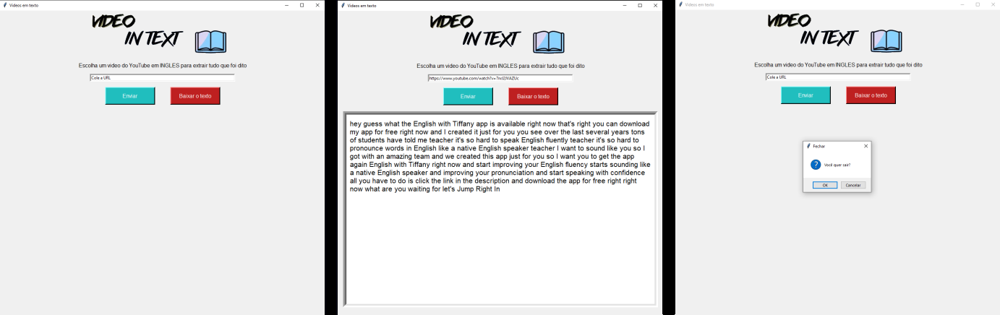

# Código para interpretar áudio e transcrever em texto

  
## Modo de usar:

Ao iniciar o codigo vai abrir a primeira tela da imagem a cima, escolha um video do youtube, em INGLES e de preferencia curto.

Cole o link na aba de entrada de dados.

Espere o codigo fazer o trabalho dele e colocar o texto na sua tela(se der erro escolha outro video).

Quando o texto aparecer se quiser use a opção de baixar o texto, criando um arquivo TXT.

## Proximos updates:

- [ ] Arrumar a formatação do bloco de notas 
- [ ] Adicionar linguagens novas 
    - [ ] PT-BR
    - [ ] Russo
    - [ ] Japones
- [ ] Adicionar na interface uma barra para escolher a linguagem do video
- [ ] Achar outra maneira de captar o audio de outros sites
