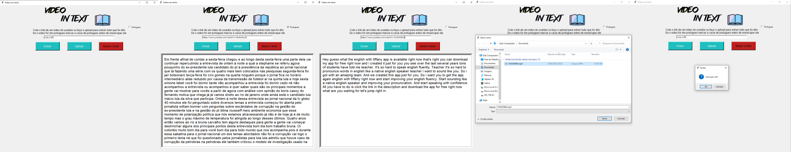

# Código para interpretar áudio e transcrever em texto

  
## Modo de usar pelo paste de link:

Ao iniciar o codigo vai abrir a primeira tela da imagem a cima, escolha um video do youtube, o tamanho do video influencia no tempo que o programa leva para ler.

Cole o link na aba de entrada de dados.

Se seu video for em ingles não marque nada, se for em português marque a caixa ANTES de clicar em enviar.

Espere o codigo fazer o trabalho dele e colocar o texto na sua tela(se der erro escolha outro video).

Quando o texto aparecer se quiser use a opção de baixar o texto, criando um arquivo TXT.

## Modo de usar pelo upload de videos:

Se seu video for em ingles não marque nada, se for em português marque a caixa ANTES de clicar em upload.

Selecione a opção de upload e escolha o arquivo que deseja ler o audio.

Espere o codigo fazer o trabalho dele e colocar o texto na sua tela(se der erro escolha outro video).

Quando o texto aparecer se quiser use a opção de baixar o texto, criando um arquivo TXT.

## Coisas que vc precisa saber ao utilizar:

O programa se basea em baixar um video, modificar o formato dele, quebrar ele em partes e rodar um reconhecimento de fala.

O texto não vai ser perfeito pois ainda não temos reconhecimento de fala perfeito.

Caso o video seja de multiplas linguagens vai dar erro.

Caracteres diferentes não são reconhecidos causando erro.

Ao usar o upload, ele vai falar que o arquivo já existe, clique em ok do mesmo jeito, vai criar uma copia para o codigo usar ele.

Se o texto for muito grande, clique na parte do texto e use o scroll do mouse para ir descendo.

O programa as vezes aparece que não esta respondendo mas normalmente é só esperar.

Ao terminar de ler seu video, feche a tela, ao fechar ela deleta todos os arquivos criados, só deixa o arquivo TXT caso vc tenha clicado em download.

